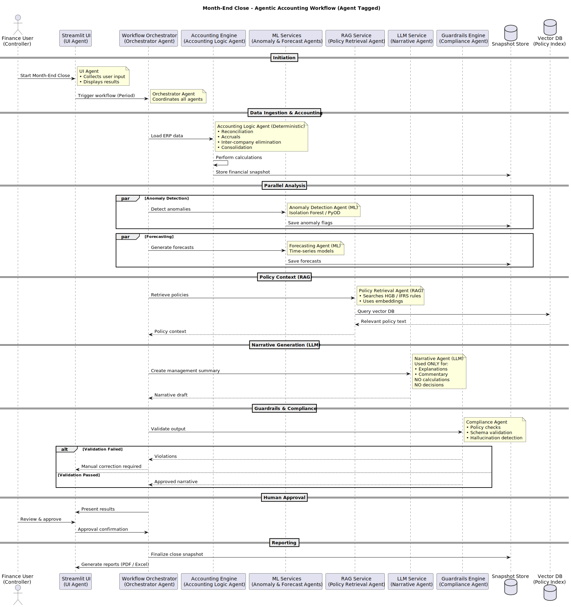

# Month-End Close — Agentic Accounting Tool

A local tool for running an agentic month-end close workflow on your own
TB + GL exports. Built to run on a Mac with Ollama, but any LiteLLM-supported
provider works (OpenAI, Anthropic, etc.) via a single env var.

## What it does

You upload your **Trial Balance** and **General Ledger** (CSV or Excel), the
tool auto-detects your columns, you confirm the mapping, and then an
orchestrated agent pipeline runs:

```
Accounting Engine  →  ML Agents        →  RAG            →  Narrative (LLM)  →  Guardrails  →  Human Approval  →  Finalise
(deterministic)       (IsolationForest +   (ChromaDB over    (LiteLLM-routed)    (4 rule-       (Streamlit      (seals snapshot,
reconciliation,       z-score;            HGB/IFRS          grounded in         based checks   button with     generates PDF+XLSX,
accruals,            linear + YoY         policy docs)      snapshot figures)   with retry    approver_id)     writes audit log)
top-N accounts,      forecast)                                                  loop)
entity rollup
```

Every step writes to an append-only SQLite audit log. Snapshots are
versioned per run_id and sealed on approval.



## Stack

| Component    | Tool                                        |
|--------------|---------------------------------------------|
| UI           | Streamlit                                   |
| Orchestrator | LangGraph                                   |
| LLM routing  | LiteLLM (Ollama / OpenAI / Anthropic)       |
| ML           | scikit-learn (IsolationForest)              |
| RAG          | ChromaDB + sentence-transformers            |
| Storage      | SQLite (audit, runs, snapshots, TB, GL)     |
| Reports      | ReportLab (PDF) + openpyxl (XLSX)           |

All local. No data leaves your Mac if you use Ollama.

---

## Prerequisites

- macOS (Apple Silicon or Intel)
- Python 3.11+
- [Ollama](https://ollama.ai) running locally (optional — only if `LLM_PROVIDER=ollama`)

---

## Setup

```bash
# 1. Clone / unzip the project, then cd into it
cd accounting_agent

# 2. Create a virtualenv and install deps
python3 -m venv .venv
source .venv/bin/activate
pip install --upgrade pip
pip install -r requirements.txt

# 3. Configure LLM provider
cp .env.example .env
# edit .env — defaults to Ollama with llama3.1:8b

# 4. If using Ollama, pull a model (once)
ollama pull llama3.1:8b
# or: ollama pull mistral, ollama pull qwen2.5:7b

# 5. Run the app
streamlit run app.py
```

Open http://localhost:8501 in your browser.

> First run is slower — sentence-transformers downloads the embedding model
> (~80 MB) and ChromaDB creates its index. Subsequent runs are instant.

---

## Using the tool

1. **Upload** — drop in your TB and GL files. Excel? Pick the sheet.
2. **Map columns** — the tool auto-suggests mappings using fuzzy matching
   against common field names (SAP, HGB, IFRS conventions). Green = high
   confidence, yellow = medium, red = unassigned. Required fields are ⭐.
   Fix any bad matches in the dropdowns.
3. **Validate** — click *Apply mapping & validate*. The tool coerces
   numbers, parses dates, and checks: TB balance per period, GL journal
   balance per journal_id, unparseable dates, empty accounts.
4. **Run** — pick a period (must overlap between TB and GL) and hit go.
5. **Review** — tabs for narrative, anomalies, forecasts, policy hits,
   and raw snapshot.
6. **Approve & download** — enter approver ID, confirm, seal. Generate
   PDF and Excel close packages.

### Policy library (RAG)

Replace the seed HGB/IFRS stubs in `data/policies/` with your own policy
`.txt` or `.md` files, or upload them via the sidebar. Click
*(Re)index policy docs* to add them to the vector store. Ingestion is
idempotent via content hashing — you can re-run it safely.

---

## Switching LLM providers

Edit `.env`:

```bash
# Ollama (local, default)
LLM_PROVIDER=ollama
OLLAMA_MODEL=llama3.1:8b

# OpenAI
LLM_PROVIDER=openai
OPENAI_API_KEY=sk-...
OPENAI_MODEL=gpt-4o-mini

# Anthropic
LLM_PROVIDER=anthropic
ANTHROPIC_API_KEY=sk-ant-...
ANTHROPIC_MODEL=claude-sonnet-4-5
```

No code changes needed — LiteLLM routes transparently.

---

## File layout

```
accounting_agent/
├── app.py                    Streamlit UI
├── orchestrator.py           LangGraph state machine
├── config.py                 env-driven config
├── reports.py                PDF + Excel export
├── requirements.txt
├── .env.example
├── Makefile
├── README.md
│
├── ingestion/
│   ├── reader.py             CSV/Excel reader, sheet enumeration
│   ├── mapper.py             fuzzy column auto-detect with confidence
│   └── validator.py          type coercion + integrity checks
│
├── storage/
│   ├── db.py                 SQLite schema, audit log, snapshots
│   └── vector_store.py       ChromaDB wrapper
│
├── agents/
│   ├── accounting.py         deterministic close engine
│   ├── ml_agents.py          anomaly + forecast
│   ├── rag_agent.py          policy retrieval
│   ├── narrative_agent.py    LLM narrative via LiteLLM
│   └── guardrails.py         4 rule-based checks
│
├── data/policies/
│   ├── hgb_principles.txt
│   └── ifrs_standards.txt
│
└── reports_out/              generated PDFs and XLSX files land here
```

---

## Operational notes

- **Audit log** is append-only. Every stage writes an event
  (`accounting.start`, `ml.done`, `rag.low_confidence`, etc.) with payload.
  View any prior run's log in the **History** tab.
- **Guardrails** run 4 checks: schema (CRITICAL), grounding — every number
  in the narrative traces back to the snapshot (WARNING), hedging language
  (WARNING), policy citation (WARNING). Warnings trigger a narrative retry
  (up to `MAX_NARRATIVE_RETRIES`). Critical failures escalate — approval
  is blocked.
- **Sealing** sets `snapshots.sealed=1` and writes `run.completed`. Reports
  can still be regenerated from a sealed snapshot; underlying data cannot.
- **Multi-period uploads** are encouraged — the ML agent needs ≥3 periods
  of history per account for z-score anomalies and ≥3 periods total for
  a forecast. Single-period uploads still work (IsolationForest alone).

---

## Troubleshooting

| Symptom                              | Fix                                              |
|--------------------------------------|--------------------------------------------------|
| `connection refused` to Ollama       | Run `ollama serve` in another terminal           |
| `model not found`                    | `ollama pull llama3.1:8b` (or your chosen model) |
| Slow first run                       | Embedding model download — wait ~1 minute       |
| Mapping dropdowns all red            | Your source columns are unusual — add aliases in `ingestion/mapper.py` → `ALIASES` |
| "No overlapping period between TB and GL" | Check your period column formats (use YYYY-MM or a parseable date) |
| Narrative cites numbers not in snapshot | Guardrail grounding check caught a hallucination. It will retry; if persistent, lower LLM temperature in `agents/narrative_agent.py` |
